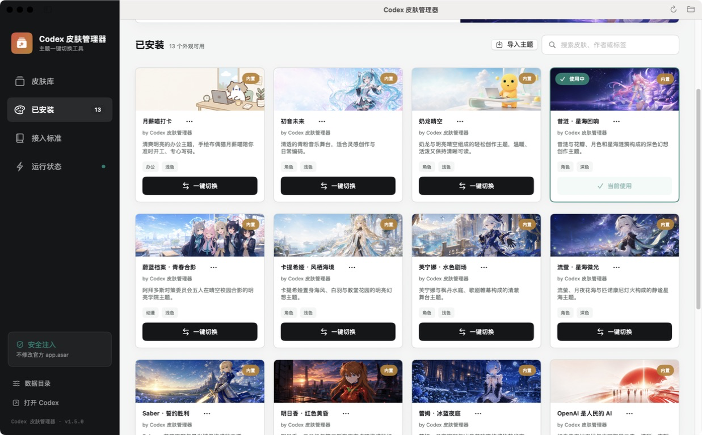
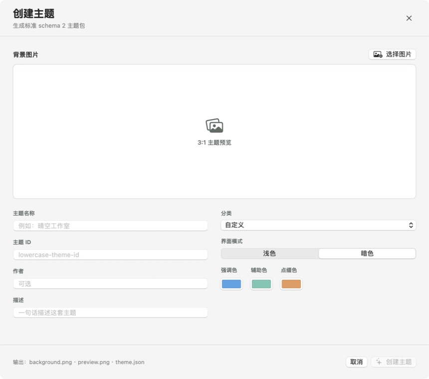

# Codex Skin Manager

<p align="center">
  
</p>

<p align="center">
  <a href="./README.md">中文</a> · <strong>English</strong>
</p>

<p align="center">
  A cross-platform theme manager for Codex Desktop.<br>
  Switch, create, import, restore, and generate themes through a bundled Codex Skill.
</p>

<p align="center">
  <a href="https://github.com/houyuhang915-sudo/Codex-Skin-Manager/releases">Downloads</a>
  ·
  <a href="./docs/theme-format.md">Theme format</a>
  ·
  <a href="./docs/platforms.md">Platforms</a>
</p>

> Current version: `1.7.0`. This is a community project and is not affiliated with OpenAI.

## Manager UI

<table>
  <tr>
    <th width="60%">Theme library and one-click switching</th>
    <th width="40%">Built-in theme creator</th>
  </tr>
  <tr>
    <td></td>
    <td></td>
  </tr>
</table>

## Theme Showcase

<table>
  <tr>
    <th width="50%">Home</th>
    <th width="50%">Chat</th>
  </tr>
  <tr>
    <td></td>
    <td></td>
  </tr>
  <tr>
    <td colspan="2" align="center"><strong>Cartethyia · Sea Breeze</strong></td>
  </tr>
  <tr>
    <td></td>
    <td></td>
  </tr>
  <tr>
    <td colspan="2" align="center"><strong>Hatsune Miku · Follow System (Light Preview)</strong></td>
  </tr>
  <tr>
    <td></td>
    <td></td>
  </tr>
  <tr>
    <td colspan="2" align="center"><strong>Cyrene · Star Sea</strong></td>
  </tr>
</table>

The screenshots come from real Codex pages. The capture utility hides conversation content, task names, project names, and private sidebar information.

## Features

- Native macOS and Windows theme managers
- Persistent macOS menu bar and Windows system tray controls with live status and quick switching
- In-app update checks, verified downloads, installation, and relaunch
- Independently updated online theme catalog for smaller theme-only downloads
- 14 bundled appearances with the stock Codex theme pinned first
- One-click theme switching with synchronized manager state
- In-app theme creation from local images
- Horizontal crop focus, light/dark appearance, and palette controls
- Strict schema 2 theme-folder import
- Theme creation through the bundled `codex-skin-theme-creator` Skill
- Automatic library refresh when a theme is created
- Shared styling for home, chat, settings, plugins, skills, notifications, and composer
- Pet overlay preserved across all theme switches
- One-click restoration of the stock Codex appearance

## Three-Minute Quick Start

1. Download the installer for your platform from [Releases](https://github.com/houyuhang915-sudo/Codex-Skin-Manager/releases).
2. Install and launch Codex Skin Manager. The first launch deploys the theme engine, bundled themes, and theme-creator Skill.
3. Keep Codex open, select a preview in the theme library, and click the one-click switch action.
4. Wait for the manager to report that the theme is applied. The current Codex window refreshes automatically.
5. After closing the main manager window, keep using the macOS `皮肤` menu or Windows system tray for quick switching.

When Codex is not running during the first switch, the manager attempts to launch it. Connection status describes the local Codex theme runtime only; it does not block browsing, creating, or importing themes.

## Download And Install

Download `v1.7.0` from [Releases](https://github.com/houyuhang915-sudo/Codex-Skin-Manager/releases).

### macOS

Download `Codex-Skin-Manager-1.7.0.dmg`, open it, then launch `安装 Codex 皮肤管理器.app` and click the install button.

Installed locations:

```text
App: ~/Applications/Codex 皮肤管理器.app
Engine: ~/.codex/codex-dream-skin-studio
Themes: ~/Library/Application Support/CodexDreamSkinStudio/themes
```

Requirements: macOS 14 or later and the official Codex desktop app.

Closing the main window keeps the manager in the macOS menu bar under the palette icon and `皮肤` label. The menu shows the active theme and live connection state, supports quick switching, and can reopen the full manager.

### Windows

Run `Codex-Skin-Manager-Setup-1.7.0.exe`. Codex may remain open during setup. Launch `Codex 皮肤管理器` from the Start menu and use **One-click switch**.

Installed locations:

```text
Engine: %LOCALAPPDATA%\CodexDreamSkin\engine-1.7.0
Themes: %LOCALAPPDATA%\CodexDreamSkin\themes
State: %LOCALAPPDATA%\CodexDreamSkin
```

Requirements: Windows 10/11 and the Microsoft Store Codex app.

Closing the main window hides the manager to the Windows system tray. Double-click the tray icon to restore it, or use its context menu for live status, quick switching, and exit.

## Background Controls

Launch Codex Skin Manager once after installation to create its persistent background entry.

| Platform | Entry | Main actions |
|---|---|---|
| macOS | The palette icon and `皮肤` label at the top-right of the screen | View the active theme and Codex connection, switch themes, restore stock appearance, reopen the manager, or exit |
| Windows | The manager icon in the notification area at the bottom-right of the taskbar | Double-click to restore the window; right-click for status, switching, stock restoration, or exit |

On macOS, the red close button closes only the main window. The manager continues running in the background. Move the pointer to the top edge when a full-screen app hides the menu bar. Use **退出皮肤管理器** in the `皮肤` menu to quit the process.

On Windows, closing the main window hides it to the system tray. Open the taskbar overflow arrow when the icon is not immediately visible.

Theme and connection state stay synchronized between the background control and the full manager.

## Software And Online Theme Updates

The manager checks in the background about six seconds after launch and does not repeat a successful check for 24 hours. Manual checks are available from the macOS toolbar and `皮肤` menu, or from the Windows header, runtime page, and system tray.

There are two update channels:

| Type | Contents | Installation | User data preserved |
|---|---|---|:---:|
| Application update | Manager, injector, installer, bundled themes, and Skill | Download and verify a full DMG or EXE | Yes |
| Online theme update | New themes or revised artwork, palette, and manifest | Download and atomically install one theme ZIP | Yes |

### Application Update Flow

1. Download the update manifest and verify its detached Ed25519 signature.
2. Compare semantic versions and select the asset for the current platform.
3. Require HTTPS and verify the declared byte size and SHA-256.
4. On macOS, mount the verified DMG and launch its automatic updater. On Windows, exit only the manager and run the verified NSIS package silently.
5. Relaunch the new manager after installation.

Codex, user themes, the active selection, and state remain in place. A network, signature, or checksum failure leaves the current version unchanged and the downloaded installer is not executed.

The signed online catalog is independent from application releases. Compatible schema 2 theme ZIPs are validated and installed atomically. New artwork and palettes can therefore ship as small theme downloads, while injector, layout-module, and schema changes continue to use full application releases.

### Update States

| State | Meaning |
|---|---|
| Up to date | The installed version matches the signed feed |
| Update available | A newer application package can be downloaded |
| Online themes available | The app does not need an upgrade; compatible themes can be installed separately |
| Checking / Downloading / Installing | A background operation is active; wait before starting it again |
| Offline or check failed | GitHub access, networking, or feed validation failed; installed content remains usable |
| Verification failed | Signature, byte size, or SHA-256 did not match and the file was rejected |

### Trust Model

- Fixed endpoints read `updates/stable.json` and `updates/themes.json` from this repository's `main` branch.
- Both manifests have detached Ed25519 signatures. The public key ships with the manager; the private key exists only in maintainer key storage and a GitHub Actions Secret.
- Every asset must use HTTPS and match both the declared byte size and SHA-256.
- Theme ZIPs additionally pass schema 2, PNG header, dimensions, path-boundary, and symbolic-link validation.
- Feed metadata describes versions and files only; it does not provide arbitrary installer arguments.

## Use A Theme

1. Open Codex Skin Manager.
2. Select a theme preview.
3. Click the one-click switch action.
4. Check the current theme, connection status, and result in the manager.
5. You can also switch directly from the macOS menu bar or Windows system tray.
6. Select the pinned stock Codex theme to restore the official appearance.

Themes change the visual layer only. Conversations, settings, projects, and composer controls remain native Codex UI.

## Troubleshooting

### The macOS `皮肤` menu is missing

Launch Codex Skin Manager once from Applications. Closing the red window button keeps it in the menu bar. In full screen, move the pointer to the top edge. If it is still missing, confirm that Codex Skin Manager is running in Activity Monitor, then reopen the app.

### The Windows tray icon is missing

Launch the manager once from the Start menu, then open the notification-area overflow arrow. Windows may place a new icon in the hidden area; use the taskbar corner-overflow setting to keep it visible.

### The manager says disconnected but themes remain selectable

Disconnected means that there is no active local CDP session with Codex. Open Codex and run the one-click switch again. The manager rediscovers the app, starts the theme runtime, and refreshes status. It automatically chooses another local port when the default is occupied.

### Codex changed theme but the manager still shows the previous theme

Allow a few seconds for the state file and UI to synchronize. Open the runtime page or reopen the main window from the menu/tray. If status is still stale, select the active theme and apply it once more; reinstalling is unnecessary.

### Part of the background or palette did not refresh

Navigate to another Codex page and return. After a Codex UI update, run the switch once more so the injector can scan the new window. For persistent visual state, restore the pinned stock theme and apply the target theme again.

### Update checking fails

Confirm access to `github.com`, `raw.githubusercontent.com`, and GitHub Release downloads. An incorrect system clock can also break HTTPS. Validation failures do not replace the installed version; retry later or install the same release manually.

### Restore stock Codex

Select the pinned stock theme or use the restore action in the menu bar/system tray. This stops theme injection and restores manager-controlled appearance settings without deleting conversations, projects, or user themes.

## Create A Theme

Open **Create Theme** in the manager:

1. Select a PNG, JPEG, WebP, or HEIC image.
2. Adjust horizontal focus.
3. Enter the name, ID, author, description, and category.
4. Choose light or dark appearance.
5. Set the accent, secondary, and highlight colors.
6. Create the theme.

The manager produces:

```text
my-theme/
├── theme.json
├── background.png   # 2400x800
└── preview.png      # 1200x400
```

The new theme appears in the library immediately.

## Codex Skill

The installers deploy `codex-skin-theme-creator` automatically. A standalone `codex-skin-theme-creator-1.7.0.zip` is also available in the Release.

Default locations:

```text
macOS: ${CODEX_HOME:-~/.codex}/skills/codex-skin-theme-creator
Windows: %CODEX_HOME%\skills\codex-skin-theme-creator
```

Example:

```text
Create a light Codex theme from this image and name it "Aqua Workspace".
```

The Skill can generate or process artwork, produce the schema 2 manifest, and atomically install the finished theme into the user library. See the [Skill workflow](./skill/codex-skin-theme-creator/SKILL.md).

## Import Contract

A theme folder contains exactly:

```text
theme-id/
├── theme.json
├── background.png
└── preview.png
```

Core requirements:

- `schemaVersion` is `2`
- IDs use lowercase letters, numbers, and hyphens
- Both images are real PNG files with an exact 3:1 ratio
- Recommended sizes are `2400x800` and `1200x400`
- `avatarOverlay` is `show`
- `appearance` is `auto`, `light`, or `dark`
- Symbolic links, escaping paths, and legacy `taskImage` fields are rejected

See [docs/theme-format.md](./docs/theme-format.md) for all fields and a complete manifest example.

## Bundled Themes

The library includes the stock Codex appearance, Salary Cat, Hatsune Miku, Nailong, Cyrene, Blue Archive Ensemble, Cartethyia, Furina, Firefly, Saber, Asuka, Rem, People's AI, and KUN Black Gold Stage.

## Runtime Model

```text
Codex Skin Manager
  ├─ manages bundled and user themes
  ├─ starts or connects to local Codex
  ├─ injects the selected theme through 127.0.0.1 CDP
  └─ verifies the applied state
                |
                v
Native Codex sidebar, chat, settings, and composer remain active
```

The project does not modify the official `.app`, `app.asar`, WindowsApps files, or official code signatures. CDP is restricted to the local loopback interface.

## Build From Source

```bash
git clone https://github.com/houyuhang915-sudo/Codex-Skin-Manager.git
cd Codex-Skin-Manager
```

Base dependencies are Git and Node.js 22 or later. macOS builds require macOS 14, Xcode Command Line Tools, and Swift. Windows device testing uses Windows PowerShell 5.1 or PowerShell 7, and producing the EXE requires NSIS.

macOS:

```bash
macos/tests/run-tests.sh
macos/scripts/build-studio-app-macos.sh \
  "$HOME/Desktop/Codex 皮肤管理器.app"
macos/scripts/build-installer-dmg-macos.sh \
  "$HOME/Desktop/Codex-Skin-Manager-1.7.0.dmg"
```

Windows:

```powershell
powershell -ExecutionPolicy Bypass -File windows\tests\run-tests.ps1
powershell -ExecutionPolicy Bypass -STA -File windows\scripts\theme-manager.ps1
```

Installer:

```bash
brew install nsis
windows/scripts/build-installer-windows.sh
```

Update-feed and cross-platform Node tests:

```bash
node script/update-feed.mjs validate
node --test macos/tests/*.test.mjs windows/tests/*.test.mjs
```

## Maintainer Release Workflow

### Configure The Signing Secret Once

Update manifests must be signed by the Ed25519 private key paired with `updates/public-key.json`. `.update-private-key.jwk` is excluded by `.gitignore`; back it up in encrypted key storage and configure the repository once:

```bash
gh secret set CODEX_UPDATE_PRIVATE_KEY_JWK \
  --repo OWNER/Codex-Skin-Manager \
  < .update-private-key.jwk
```

Do not commit, screenshot, or upload the private key. Losing it requires a transition release with a newly embedded public key, so retain at least one separate encrypted backup.

### Publish A Full Application Release

1. Update `macos/VERSION`, platform manager/injector/installer version constants, and both changelogs.
2. Update versioned installer names in the READMEs.
3. Run macOS, Windows, Node, signed-feed, and packaging tests.
4. Merge and push `main`, then confirm CI passes.
5. Create and push a tag that exactly matches the version:

```bash
git tag -a v1.7.0 -m "Codex Skin Manager v1.7.0"
git push origin main
git push origin v1.7.0
```

The tag starts the [Release workflow](./.github/workflows/release.yml), which:

1. Builds the DMG on a macOS runner and the NSIS EXE on a Windows runner.
2. Packages the `codex-skin-theme-creator` Skill.
3. Produces a SHA-256 list for all three packages.
4. Creates a GitHub Release and uploads packages, the Skill, checksums, and signed manifests.
5. Signs the new update feed using the GitHub Secret and commits the final `updates/` files back to `main`.

After publishing, confirm that the Release contains at least the DMG, EXE, Skill ZIP, and SHA-256 file, then run:

```bash
git pull --ff-only
node script/update-feed.mjs validate
```

### Publish An Online Theme Only

When a theme changes only artwork, copy, or palette and needs no new injector, publish its ZIP independently:

```bash
node script/update-feed.mjs add-theme \
  --theme PATH/TO/THEME_ID \
  --theme-version 2 \
  --minimum-app 1.7.0 \
  --url https://github.com/OWNER/Codex-Skin-Manager/releases/download/TAG/THEME_ID-2.zip \
  --output release/THEME_ID-2.zip \
  --private-key .update-private-key.jwk
```

Upload the ZIP to the Release used by the URL, commit the updated `updates/stable.json`, `updates/themes.json`, and both `.sig` files, then run `node script/update-feed.mjs validate`. The manager downloads only that theme package on its next check.

## Repository Layout

```text
macos/                         macOS manager, installer, runtime, and themes
windows/                       Windows manager, installer, runtime, and themes
skill/codex-skin-theme-creator Codex theme creator Skill
docs/images/showcase/          Sanitized README screenshots
docs/theme-format.md           Schema 2 theme format
docs/platforms.md              Platform paths and capability matrix
script/                        Build and documentation utilities
```

## Verification

The release passes macOS build and regression checks, Windows PowerShell 5.1 and PowerShell 7 tests, cross-platform Node.js renderer tests, GitHub Actions static checks, DMG verification, NSIS format inspection, and Skill validation.

Use `Codex-Skin-Manager-1.7.0-SHA256.txt` from the Release to verify downloaded files.

## License

Code is released under the [MIT License](./LICENSE). Character themes demonstrate the theme system; confirm the applicable image, character-name, and trademark conditions before redistribution or commercial use.

## Attribution

This project references the theme-injection approach from [Fei-Away/Codex-Dream-Skin](https://github.com/Fei-Away/Codex-Dream-Skin) and independently develops the cross-platform manager, theme library, installers, creation tools, and Codex Skill.
